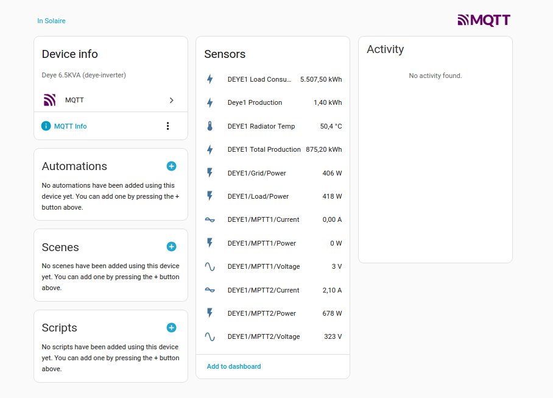
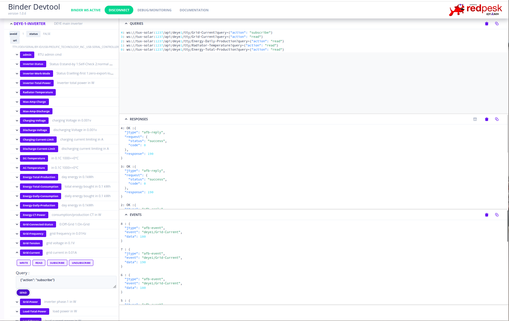
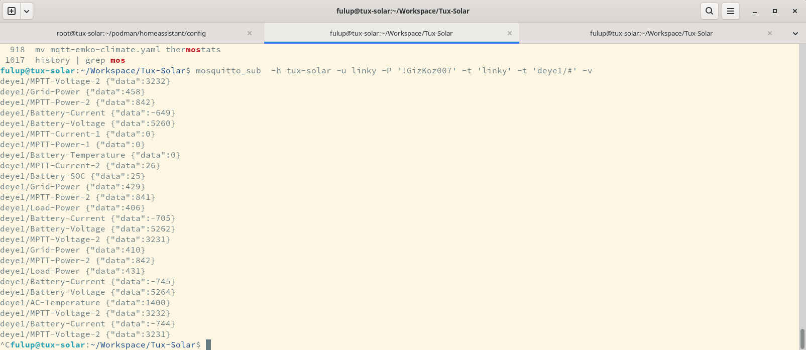

# Deye Inverter modbus to homeassistant bridge

For security concern Redpesk default transport is websocket. Unfortunately/fortunately HA uses mqtt. Usually they are (very) little cybersecurity concerns on home-automation personal project and bridging MQTT remains simple and acceptable. Would you have security concerns that you should enable Redpesk or equivalent privileges restrictions to secure your data transport model.

Configuration files for:
* Deye Modbus MAP for Redpesk Modbus-Binding
* MQTT topic transport map
* Virtual MQTT sensors for HomeAssistant

## References:

* redpesk binding sources: https://github.com/redpesk-industrial/modbus-binding
* redpesk images: https://docs.redpesk.bzh/docs/en/master/redpesk-industrial/docs/introduction.html

## Configuration

* etc/modbus-deye-*-tty.yaml: modbus register configuration 
* etc/modbus-deye-*-tty.yaml: mqtt bridge 
* homeassistant/*: DEYE physical and virtual sensor definition for HA
* systemd/deye*.service: systemd configuration files. Note that MQTT secret are define in EnvironmentFile=/etc/secrets/mqtt.secrets in order not to expose them on git.

### Homeassistant imported sensors

Only MQTT exposed sensors are visible to homeassistant. By default Redpesk push register value to MQTT only when they change


### Modbus Redpesk Binding

Redpesk devtools provides a raw vision on DEYE modbus registers. You can choose which register are push to MQTT or not


### MQTT topic

You can check MQTT  message with 
```
mosquitto_sub  -h tux-solar -u linky -P '!GizKoz007' -t 'linky' -t 'deye1/#' -v
```


